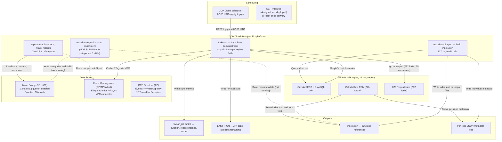
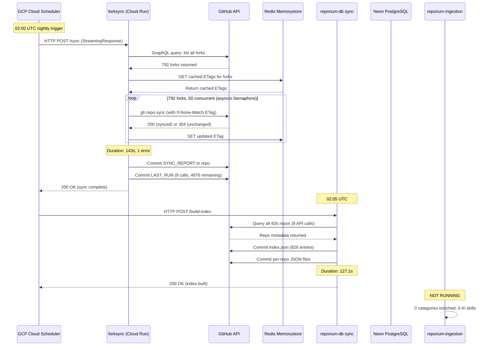
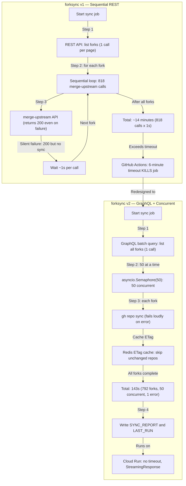
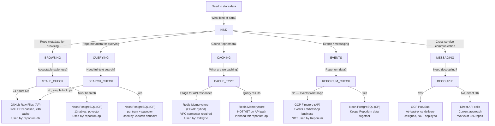
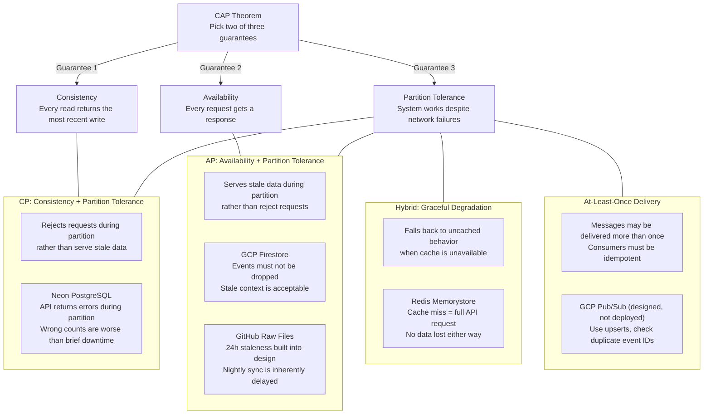

# 07 - Diagrams

Five architecture diagrams for the Reporium platform. All diagrams use Mermaid syntax and render on GitHub.

---

## 1. Full Platform Architecture

---

## 2. Nightly Pipeline Sequence

---

## 3. forksync v1 vs v2

---

## 4. Data Store Selection Decision Tree

---

## 5. CAP Theorem Visualization

